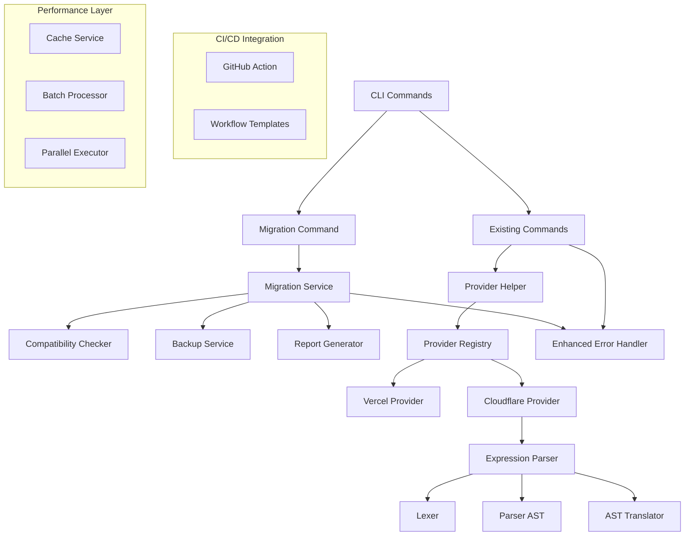

# Design Document

## Overview

This design document outlines the implementation approach for completing Phase 6 of Cloudflare support in Doorman. The design builds upon the existing multi-provider architecture (Phases 1-5) to add advanced features including cross-provider migration, CI/CD integration, enhanced expression parsing, and quality improvements.

The design follows the established patterns in the codebase while introducing new services and utilities to support the advanced functionality required for production-ready multi-provider usage.

## Architecture

### High-Level Architecture



### Component Relationships

The design extends the existing provider architecture with new services that integrate seamlessly with the current codebase:

1. **Migration Layer**: New services for cross-provider migration
2. **Expression Parser**: Enhanced parsing for complex Cloudflare expressions
3. **CI/CD Integration**: GitHub Actions and workflow templates
4. **Performance Layer**: Caching, batching, and parallel execution
5. **Enhanced Error Handling**: Structured errors with actionable guidance

## Components and Interfaces

### 1. Migration Service Architecture

```typescript
interface IMigrationService {
  analyzeMigration(options: MigrationAnalysisOptions): Promise<MigrationAnalysis>
  executeMigration(options: MigrationOptions): Promise<MigrationResult>
  rollbackMigration(backupId: string): Promise<RollbackResult>
  validateMigration(result: MigrationResult): Promise<ValidationResult>
}

interface MigrationAnalysisOptions {
  sourceProvider: ProviderType
  targetProvider: ProviderType
  sourceConfig?: UnifiedConfig
  rules?: string[] // specific rule IDs to migrate
}

interface MigrationAnalysis {
  compatibility: CompatibilityReport
  translation: TranslationReport
  performance: PerformanceEstimate
  recommendations: string[]
}

interface MigrationOptions extends MigrationAnalysisOptions {
  dryRun?: boolean
  backup?: boolean
  autoApprove?: boolean
  rollbackOnError?: boolean
  reportPath?: string
}
```

### 2. Expression Parser Architecture

```typescript
interface IExpressionParser {
  parse(expression: string): Promise<ExpressionAST>
  validate(ast: ExpressionAST): ValidationResult
  optimize(ast: ExpressionAST): ExpressionAST
  translate(ast: ExpressionAST, targetProvider: ProviderType): TranslationResult
}

interface ExpressionAST {
  type: 'comparison' | 'logical' | 'unary' | 'group' | 'function'
  // AST node structure as defined in Phase 6 planning
}

interface IExpressionLexer {
  tokenize(input: string): Token[]
}

interface IExpressionValidator {
  validateSyntax(ast: ExpressionAST): ValidationResult
  validateSemantics(ast: ExpressionAST, provider: ProviderType): ValidationResult
}
```

### 3. Enhanced Error Handling

```typescript
interface IErrorHandler {
  formatError(error: DoormanError): string
  createError(code: ErrorCode, message: string, options?: ErrorOptions): DoormanError
  handleProviderError(error: unknown, provider: ProviderType): DoormanError
}

interface ErrorOptions {
  suggestion?: string
  details?: Record<string, unknown>
  docsUrl?: string
  severity?: 'error' | 'warning' | 'info'
}

enum ErrorCode {
  // Migration errors (4000-4999)
  MIGRATION_FAILED = 'MIG_4000',
  MIGRATION_INCOMPATIBLE = 'MIG_4001',
  MIGRATION_ROLLBACK_FAILED = 'MIG_4002',

  // Expression parser errors (6000-6999)
  EXPRESSION_PARSE_ERROR = 'EXPR_6000',
  EXPRESSION_INVALID_SYNTAX = 'EXPR_6001',
  EXPRESSION_UNSUPPORTED_FEATURE = 'EXPR_6002',

  // Performance errors (7000-7999)
  PERFORMANCE_TIMEOUT = 'PERF_7000',
  PERFORMANCE_MEMORY_LIMIT = 'PERF_7001',
}
```

### 4. Performance Layer

```typescript
interface ICacheService {
  get<T>(key: string): Promise<T | undefined>
  set<T>(key: string, value: T, ttl?: number): Promise<void>
  invalidate(pattern: string): Promise<void>
  clear(): Promise<void>
}

interface IBatchProcessor {
  batch<T, R>(items: T[], processor: (item: T) => Promise<R>, options?: BatchOptions): Promise<R[]>
}

interface IParallelExecutor {
  execute<T>(tasks: (() => Promise<T>)[], options?: ParallelOptions): Promise<T[]>
}
```

### 5. GitHub Actions Integration

```typescript
interface IGitHubActionService {
  validateInputs(inputs: ActionInputs): ValidationResult
  executeCommand(command: string, options: ActionOptions): Promise<ActionResult>
  formatOutputs(result: ActionResult): ActionOutputs
}

interface ActionInputs {
  command: 'validate' | 'sync' | 'diff' | 'status'
  provider?: ProviderType
  config?: string
  dryRun?: boolean
  credentials: ProviderCredentials
}
```

## Data Models

### Migration Models

```typescript
interface MigrationReport {
  metadata: {
    timestamp: string
    sourceProvider: ProviderType
    targetProvider: ProviderType
    durationMs: number
    version: string
  }

  summary: {
    totalRules: number
    migratedRules: number
    fullyCompatible: number
    partiallyCompatible: number
    incompatible: number
    totalIPs: number
    migratedIPs: number
  }

  compatibility: {
    warnings: CompatibilityWarning[]
    incompatibleRules: RuleIncompatibility[]
    recommendations: string[]
  }

  translation: {
    confidenceScore: number // 0-100
    translationIssues: TranslationIssue[]
    optimizations: Optimization[]
  }

  performance: {
    estimatedLatencyImpact: string
    costComparison?: CostComparison
    ruleComplexity: ComplexityAnalysis
  }

  rollback: {
    backupId: string
    rollbackCommand: string
    backupLocation: string
  }
}

interface CompatibilityWarning {
  ruleId: string
  ruleName?: string
  severity: 'warning' | 'error' | 'info'
  message: string
  suggestion: string
  affectedFields: string[]
}

interface TranslationIssue {
  ruleId: string
  field: string
  issue: string
  originalValue: unknown
  translatedValue: unknown
  alternativeSolutions: string[]
  confidenceScore: number
}
```

### Expression Parser Models

```typescript
type Expression = ComparisonExpression | LogicalExpression | UnaryExpression | GroupExpression | FunctionExpression

interface ComparisonExpression {
  type: 'comparison'
  field: FieldExpression
  operator: ComparisonOperator
  value: ValueExpression
  location: SourceLocation
}

interface LogicalExpression {
  type: 'logical'
  left: Expression
  operator: 'and' | 'or'
  right: Expression
  location: SourceLocation
}

interface FieldExpression {
  type: 'field'
  path: string[]
  index?: Expression // For array access like headers["X-Custom"]
  location: SourceLocation
}

interface Token {
  type: TokenType
  value: string
  start: number
  end: number
  line: number
  column: number
}

type TokenType =
  | 'IDENTIFIER'
  | 'STRING'
  | 'NUMBER'
  | 'BOOLEAN'
  | 'EQ'
  | 'NE'
  | 'LT'
  | 'LE'
  | 'GT'
  | 'GE'
  | 'CONTAINS'
  | 'MATCHES'
  | 'IN'
  | 'AND'
  | 'OR'
  | 'NOT'
  | 'LPAREN'
  | 'RPAREN'
  | 'LBRACKET'
  | 'RBRACKET'
  | 'DOT'
  | 'COMMA'
  | 'EOF'
```

## Error Handling

### Error Classification and Response Strategy

```typescript
class DoormanError extends Error {
  constructor(
    public code: ErrorCode,
    message: string,
    public suggestion?: string,
    public details?: Record<string, unknown>,
    public docsUrl?: string,
    public severity: 'error' | 'warning' | 'info' = 'error',
  ) {
    super(message)
    this.name = 'DoormanError'
  }

  format(): string {
    const parts = [chalk.red(`[${this.code}] ${this.message}`), '']

    if (this.suggestion) {
      parts.push(chalk.yellow('💡 Suggestion:'), `  ${this.suggestion}`, '')
    }

    if (this.details && Object.keys(this.details).length > 0) {
      parts.push(chalk.dim('📋 Details:'))
      Object.entries(this.details).forEach(([key, value]) => {
        parts.push(`  • ${key}: ${value}`)
      })
      parts.push('')
    }

    if (this.docsUrl) {
      parts.push(chalk.cyan('📖 Documentation:'), `  ${this.docsUrl}`)
    }

    return parts.join('\n')
  }
}
```

### Error Recovery Strategies

1. **Migration Errors**: Automatic rollback with detailed failure analysis
2. **Expression Parser Errors**: Fallback to simplified translation with warnings
3. **API Errors**: Retry with exponential backoff and rate limit handling
4. **Validation Errors**: Partial validation with specific field guidance
5. **Performance Errors**: Graceful degradation with progress indicators

## Testing Strategy

### Test Architecture

```typescript
// Unit Tests Structure
src/lib/services/__tests__/
├── MigrationService.test.ts
├── CompatibilityChecker.test.ts
├── BackupService.test.ts
└── ReportGenerator.test.ts

src/lib/translators/expression/__tests__/
├── Lexer.test.ts
├── Parser.test.ts
├── Validator.test.ts
├── Translator.test.ts
└── integration/
    ├── ComplexExpressions.test.ts
    └── ProviderTranslation.test.ts

src/commands/__tests__/
├── migrate.test.ts
└── integration/
    ├── MigrationWorkflow.test.ts
    └── ErrorHandling.test.ts
```

### Test Categories

1. **Unit Tests**: Individual component testing with mocked dependencies
2. **Integration Tests**: End-to-end workflow testing with real provider APIs
3. **Performance Tests**: Benchmarking for optimization validation
4. **Error Handling Tests**: Comprehensive error scenario coverage
5. **GitHub Actions Tests**: Workflow validation in CI environment

### Test Data Strategy

```typescript
// Test fixtures for consistent testing
interface TestFixtures {
  vercelRules: VercelRule[]
  cloudflareRules: CloudflareRule[]
  unifiedRules: UnifiedRule[]
  complexExpressions: string[]
  migrationScenarios: MigrationTestCase[]
}

interface MigrationTestCase {
  name: string
  sourceProvider: ProviderType
  targetProvider: ProviderType
  sourceRules: UnifiedRule[]
  expectedResult: MigrationExpectation
  expectedWarnings: string[]
}
```

## Implementation Phases

### Phase 6.1: Foundation (Weeks 1-2)

- Migration command structure and basic workflow
- Enhanced error handling system
- Performance optimization infrastructure
- Basic expression parser foundation

### Phase 6.2: Core Features (Weeks 3-4)

- Complete migration service implementation
- Expression parser with AST generation
- Compatibility checker and report generator
- Backup and rollback functionality

### Phase 6.3: Advanced Features (Weeks 5-6)

- Expression optimization and advanced translation
- GitHub Actions integration
- Performance optimizations (caching, batching)
- Comprehensive error handling

### Phase 6.4: Polish and Integration (Weeks 7-8)

- Complete test coverage
- Documentation and examples
- Performance benchmarking
- Final integration and bug fixes

## Security Considerations

### Credential Management

- Secure handling of API tokens in CI/CD environments
- Credential validation and rotation support
- Audit logging for sensitive operations

### Migration Safety

- Backup creation before any destructive operations
- Rollback capability for failed migrations
- Validation of migrated rules before activation

### Expression Parser Security

- Input sanitization for expression parsing
- Resource limits to prevent DoS attacks
- Safe evaluation of parsed expressions

## Performance Requirements

### Scalability Targets

- Support for 1000+ rules per configuration
- Migration completion within 5 minutes for typical setups
- Expression parsing under 10ms for complex expressions
- Cache hit ratio above 80% for repeated operations

### Resource Optimization

- Memory usage under 100MB for typical operations
- Parallel processing for independent operations
- Efficient diff algorithms for large rule sets
- Connection pooling for API calls

## Monitoring and Observability

### Metrics Collection

- Migration success/failure rates
- Expression parsing performance
- API call latency and error rates
- Cache hit/miss ratios

### Logging Strategy

- Structured logging with correlation IDs
- Debug logging for troubleshooting
- Audit logs for security-sensitive operations
- Performance metrics for optimization

This design provides a comprehensive foundation for implementing the remaining Phase 6 features while maintaining consistency with the existing codebase architecture and patterns.
