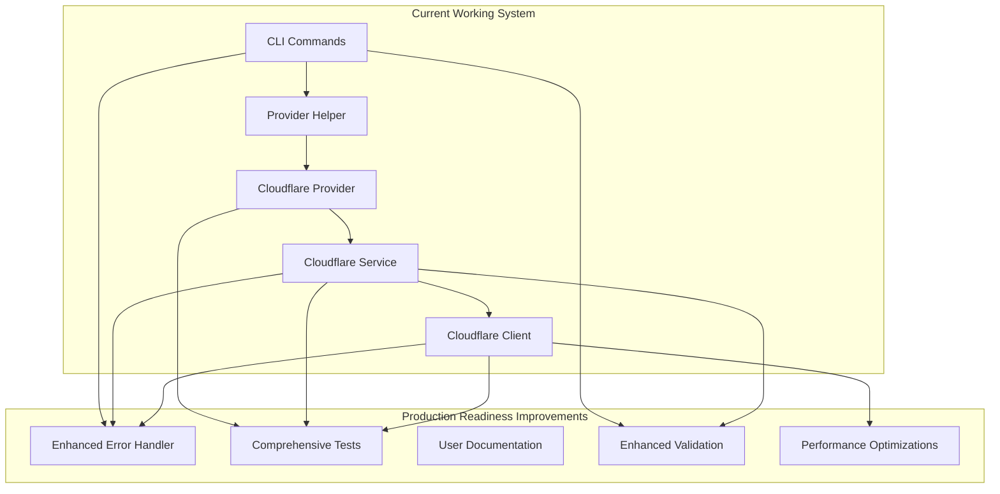

# Design Document

## Overview

This design document outlines the implementation approach for making Cloudflare support production-ready in Doorman. The design focuses on essential improvements to error handling, testing, documentation, and stability rather than new features. The goal is to take the existing functional Cloudflare implementation and make it reliable and user-friendly enough for production use.

## Architecture

### Current State Analysis

Based on the existing documentation, the current Cloudflare implementation includes:

- ✅ Complete provider infrastructure (IFirewallProvider, BaseFirewallClient, BaseFirewallService)
- ✅ CloudflareClient with full CRUD operations for rulesets, rules, and lists
- ✅ CloudflareFirewallService with sync/fetch/validate functionality
- ✅ Rule translation system with warning surfacing
- ✅ Basic credential verification
- ✅ Integration with existing commands via `--provider cloudflare`

### Areas Needing Improvement



## Components and Interfaces

### 1. Enhanced Error Handling System

```typescript
interface ICloudflareErrorHandler {
  handleApiError(error: CloudflareApiError): DoormanError
  handleCredentialError(error: CredentialError): DoormanError
  handleValidationError(error: ValidationError): DoormanError
  formatWarning(warning: TranslationWarning): string
}

interface CloudflareApiError {
  status: number
  code: string
  message: string
  details?: Record<string, unknown>
}

interface DoormanError extends Error {
  code: string
  suggestion: string
  details: Record<string, unknown>
  docsUrl: string
  severity: 'error' | 'warning' | 'info'
}

// Specific error codes for Cloudflare
enum CloudflareErrorCode {
  // Credential errors
  CF_INVALID_TOKEN = 'CF_1001',
  CF_INVALID_ZONE_ID = 'CF_1002',
  CF_INVALID_ACCOUNT_ID = 'CF_1003',
  CF_INSUFFICIENT_PERMISSIONS = 'CF_1004',

  // API errors
  CF_RATE_LIMITED = 'CF_2001',
  CF_ZONE_NOT_FOUND = 'CF_2002',
  CF_RULESET_NOT_FOUND = 'CF_2003',
  CF_LIST_NOT_AVAILABLE = 'CF_2004',

  // Configuration errors
  CF_CONFIG_INVALID = 'CF_3001',
  CF_TRANSLATION_WARNING = 'CF_3002',
  CF_FEATURE_UNSUPPORTED = 'CF_3003',
}
```

### 2. Enhanced Validation System

```typescript
interface ICloudflareValidator {
  validateCredentials(credentials: CloudflareCredentials): Promise<ValidationResult>
  validateConfiguration(config: UnifiedConfig): ValidationResult
  validateZoneAccess(zoneId: string, token: string): Promise<ValidationResult>
  validateAccountAccess(accountId: string, token: string): Promise<ValidationResult>
}

interface CloudflareCredentials {
  apiToken: string
  zoneId: string
  accountId?: string
}

interface ValidationResult {
  valid: boolean
  errors: ValidationError[]
  warnings: ValidationWarning[]
  suggestions: string[]
}

interface ValidationError {
  field: string
  message: string
  suggestion: string
  docsUrl?: string
}
```

### 3. Performance Optimization Layer

```typescript
interface ICloudflarePerformanceOptimizer {
  batchApiCalls<T>(calls: (() => Promise<T>)[]): Promise<T[]>
  cacheApiResponse<T>(key: string, response: T, ttl?: number): void
  getCachedResponse<T>(key: string): T | undefined
  retryWithBackoff<T>(operation: () => Promise<T>, options?: RetryOptions): Promise<T>
}

interface RetryOptions {
  maxRetries: number
  baseDelay: number
  maxDelay: number
  backoffFactor: number
}
```

### 4. Enhanced Configuration Management

```typescript
interface ICloudflareConfigManager {
  initializeConfig(options: CloudflareInitOptions): Promise<UnifiedConfig>
  migrateFromVercel(vercelConfig: any): UnifiedConfig
  validateSetup(config: UnifiedConfig): Promise<SetupValidationResult>
  detectConfigurationIssues(config: UnifiedConfig): ConfigurationIssue[]
}

interface CloudflareInitOptions {
  interactive: boolean
  apiToken?: string
  zoneId?: string
  accountId?: string
  migrateFrom?: 'vercel'
}

interface SetupValidationResult {
  credentialsValid: boolean
  zoneAccessible: boolean
  accountAccessible: boolean
  listsAvailable: boolean
  issues: ConfigurationIssue[]
  recommendations: string[]
}
```

## Data Models

### Error Response Models

```typescript
interface CloudflareErrorResponse {
  success: false
  errors: Array<{
    code: number
    message: string
    error_chain?: Array<{
      code: number
      message: string
    }>
  }>
  messages: string[]
  result: null
}

interface FormattedError {
  code: string
  title: string
  message: string
  suggestion: string
  details: Record<string, unknown>
  docsUrl: string
  severity: 'error' | 'warning' | 'info'
}
```

### Configuration Models

```typescript
interface CloudflareSetupGuide {
  steps: SetupStep[]
  troubleshooting: TroubleshootingItem[]
  examples: ConfigurationExample[]
}

interface SetupStep {
  title: string
  description: string
  action: string
  validation?: string
  troubleshooting?: string[]
}

interface TroubleshootingItem {
  problem: string
  symptoms: string[]
  solutions: string[]
  relatedDocs: string[]
}
```

## Error Handling Strategy

### Error Classification and Response

```typescript
class CloudflareErrorHandler implements ICloudflareErrorHandler {
  private errorMappings = new Map<number, ErrorMapping>()

  constructor() {
    this.initializeErrorMappings()
  }

  handleApiError(error: CloudflareApiError): DoormanError {
    const mapping = this.errorMappings.get(error.status) || this.getDefaultMapping()

    return new DoormanError(
      mapping.code,
      this.formatMessage(error, mapping),
      mapping.suggestion,
      {
        originalError: error,
        endpoint: error.details?.endpoint,
        timestamp: new Date().toISOString(),
      },
      mapping.docsUrl,
    )
  }

  private initializeErrorMappings(): void {
    this.errorMappings.set(401, {
      code: CloudflareErrorCode.CF_INVALID_TOKEN,
      suggestion: 'Check your CLOUDFLARE_API_TOKEN environment variable or config file',
      docsUrl: 'https://docs.doorman.griffen.codes/cloudflare/setup#api-token',
    })

    this.errorMappings.set(403, {
      code: CloudflareErrorCode.CF_INSUFFICIENT_PERMISSIONS,
      suggestion: 'Ensure your API token has Zone:Edit and Account:Read permissions',
      docsUrl: 'https://docs.doorman.griffen.codes/cloudflare/setup#permissions',
    })

    this.errorMappings.set(429, {
      code: CloudflareErrorCode.CF_RATE_LIMITED,
      suggestion: 'Wait 60 seconds and try again, or use --retry flag for automatic retries',
      docsUrl: 'https://docs.doorman.griffen.codes/cloudflare/troubleshooting#rate-limits',
    })
  }
}
```

### Graceful Degradation Strategy

1. **Lists API Unavailable**: Fall back to individual IP rules with clear messaging
2. **Partial Translation**: Continue with warnings for unsupported features
3. **Network Issues**: Retry with exponential backoff, show progress
4. **Invalid Configuration**: Validate incrementally, show specific field errors
5. **Permission Issues**: Provide specific guidance on required permissions

## Testing Strategy

### Test Structure

```typescript
// Test organization
src/lib/providers/cloudflare/__tests__/
├── unit/
│   ├── CloudflareClient.test.ts
│   ├── CloudflareFirewallService.test.ts
│   ├── CloudflareErrorHandler.test.ts
│   └── CloudflareValidator.test.ts
├── integration/
│   ├── CloudflareWorkflow.test.ts
│   ├── ErrorHandling.test.ts
│   └── PerformanceOptimization.test.ts
└── fixtures/
    ├── mockResponses.ts
    ├── testConfigurations.ts
    └── errorScenarios.ts
```

### Test Categories

1. **Unit Tests**: Individual component testing with comprehensive mocking
2. **Integration Tests**: End-to-end workflow testing with API mocking
3. **Error Handling Tests**: Comprehensive error scenario coverage
4. **Performance Tests**: Basic performance validation for typical operations
5. **Configuration Tests**: Setup and validation workflow testing

### Mock Strategy

```typescript
interface CloudflareMockService {
  mockSuccessfulAuth(): void
  mockInvalidCredentials(): void
  mockRateLimiting(): void
  mockNetworkError(): void
  mockPartialFailure(): void
  mockListsUnavailable(): void
}

// Example test structure
describe('CloudflareErrorHandler', () => {
  describe('API Error Handling', () => {
    it('should format 401 errors with credential guidance', () => {
      // Test implementation
    })

    it('should format 429 errors with retry suggestions', () => {
      // Test implementation
    })

    it('should handle unknown errors gracefully', () => {
      // Test implementation
    })
  })
})
```

## Performance Optimization Design

### Caching Strategy

```typescript
class CloudflareCache {
  private cache = new Map<string, CacheEntry>()
  private readonly DEFAULT_TTL = 5 * 60 * 1000 // 5 minutes

  // Cache API responses that don't change frequently
  cacheZoneInfo(zoneId: string, info: ZoneInfo): void
  cacheRulesetList(zoneId: string, rulesets: Ruleset[]): void
  cacheAccountInfo(accountId: string, info: AccountInfo): void

  // Cache validation results
  cacheCredentialValidation(token: string, result: ValidationResult): void
  cacheConfigValidation(configHash: string, result: ValidationResult): void
}
```

### Batch Processing

```typescript
class CloudflareBatchProcessor {
  // Batch rule operations where possible
  async batchRuleOperations(operations: RuleOperation[]): Promise<RuleOperationResult[]> {
    const batches = this.groupOperationsByType(operations)
    const results = await Promise.all([
      this.processBatch(batches.creates),
      this.processBatch(batches.updates),
      this.processBatch(batches.deletes),
    ])
    return results.flat()
  }

  // Parallel processing for independent operations
  async parallelZoneOperations(zoneIds: string[], operation: (zoneId: string) => Promise<any>): Promise<any[]> {
    return Promise.all(zoneIds.map(operation))
  }
}
```

## Documentation Structure

### User Documentation

```markdown
docs/cloudflare/
├── setup.md # Complete setup guide
├── migration.md # Migration from Vercel guide  
├── troubleshooting.md # Common issues and solutions
├── configuration.md # Configuration options and examples
├── limitations.md # Current limitations and workarounds
└── api-reference.md # CLI command reference
```

### Setup Guide Content

1. **Prerequisites**: API token creation, finding zone/account IDs
2. **Installation**: Environment variables, configuration file setup
3. **Verification**: Testing connectivity and permissions
4. **First Sync**: Step-by-step first synchronization
5. **Common Patterns**: Typical configuration examples
6. **Troubleshooting**: Most common setup issues

## Implementation Phases

### Phase 1: Error Handling and Validation (Week 1)

- Implement enhanced error handling system
- Add comprehensive credential and configuration validation
- Create user-friendly error messages with suggestions

### Phase 2: Testing Infrastructure (Week 1-2)

- Create comprehensive test suite for Cloudflare provider
- Add error handling and edge case tests
- Implement performance baseline tests

### Phase 3: Performance and Reliability (Week 2)

- Add retry logic with exponential backoff
- Implement basic caching for API responses
- Add graceful handling of network issues

### Phase 4: Documentation and Examples (Week 2-3)

- Create complete setup and migration guides
- Add troubleshooting documentation
- Create configuration examples and templates

### Phase 5: Integration and Polish (Week 3)

- Integrate improvements with existing commands
- Final testing and bug fixes
- Prepare for production release

## Success Metrics

### Reliability Metrics

- Zero unhandled exceptions in normal operation
- Graceful handling of all documented API error scenarios
- 95%+ success rate for valid configurations

### User Experience Metrics

- Clear error messages for 100% of failure scenarios
- Setup completion within 5 minutes for typical users
- Comprehensive troubleshooting coverage for common issues

### Performance Metrics

- Sync operations complete within 30 seconds for typical configs
- Status checks complete within 5 seconds
- 80%+ cache hit rate for repeated operations

This design provides a focused approach to making Cloudflare support production-ready while building on the existing solid foundation.
